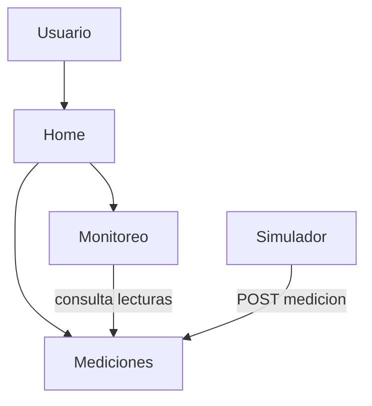

# Sistema Distribuido de Monitoreo IoT (Simulado) — AgroSense

## Problema que resuelve

En zonas rurales o alejadas, con acceso limitado a energía eléctrica e internet, es
difícil realizar un monitoreo constante de variables ambientales como temperatura,
humedad, calidad del agua, estado del suelo y calidad del aire. La falta de datos
digitalizados y actualizados dificulta la toma de decisiones en actividades como la
agricultura, la investigación ambiental y el cuidado de los recursos naturales.

El sistema resuelve esto mediante una red de sensores IoT **simulada** que recolecta,
transmite y centraliza datos ambientales, facilitando su consulta y análisis, y
sentando la base para la generación de alertas cuando los valores salen de rango.

## Objetivo

Diseñar y comenzar a materializar, mediante contenedores, una solución distribuida
basada en microservicios que reciba, almacene y analice mediciones de sensores
simulados, con una vista Home como punto de entrada del usuario.

## Integrantes y roles

| Integrante | Rol principal |
|---|---|
| Nicolas Gaviria | Arquitectura, Docker Compose e integración |
| Jainer Chocue | Servicios Mediciones y Monitoreo (APIs REST) |
| Sebastián Paja | Dockerfiles y contenerización de los servicios |
| Freyder Pacho | Vista Home y documentación |

> El proyecto se construye de forma colaborativa; cada integrante tiene una
> responsabilidad principal pero participa en la revisión del trabajo del resto.

## Arquitectura

Se usa una **arquitectura de microservicios** sobre un estilo **cliente–servidor**:
el usuario accede desde el navegador a la vista Home, y cada responsabilidad del
sistema (almacenar mediciones, calcular resúmenes, generar datos) vive en un servicio
independiente que se comunica por **HTTP/REST con JSON**.



El detalle completo (componentes, decisiones y pendientes) está en
[docs/ARCHITECTURE.md](docs/ARCHITECTURE.md).

### Cambio respecto al diseño inicial

Se **descartó el servicio de Sensores** para este avance. El catálogo de sensores se
maneja como una lista fija dentro del Simulador; un servicio de Sensores independiente
se evaluará más adelante si la gestión de dispositivos lo justifica.

## Servicios

| Servicio | Responsabilidad | Puerto | Se comunica con |
|---|---|---|---|
| **Home** | Vista web estática (Nginx). Punto de entrada del usuario. | `8080` | — |
| **Mediciones** | Recibir y almacenar lecturas (simuladas) y permitir consultarlas por sensor. API Flask. | `5001` | Monitoreo, Simulador |
| **Monitoreo** | Consultar las mediciones de un sensor y calcular un resumen (cantidad, promedio, última lectura). API Flask. | `5002` | Mediciones |
| **Simulador** | Generar valores de temperatura y humedad para un catálogo fijo de sensores y enviarlos periódicamente a Mediciones. Proceso, no expone API. | — | Mediciones |

Documentación detallada de cada servicio:

- [Servicio de Mediciones](docs/servicios/servicio-1-mediciones.md)
- [Servicio de Monitoreo](docs/servicios/servicio-2-monitoreo.md)
- [Servicio Simulador](docs/servicios/servicio-3-simulador.md)
- [Servicio Home](docs/servicios/servicio-4-home.md)

## Comunicación entre servicios

| Quién solicita | A quién | Qué información | Método HTTP |
|---|---|---|---|
| Monitoreo | Mediciones | Últimas lecturas de un sensor | `GET /mediciones?sensor_id=X` |
| Simulador | Mediciones | Registrar una nueva lectura | `POST /mediciones` |

## Docker

Todos los componentes están contenerizados:

| Componente | Imagen base | Dockerfile |
|---|---|---|
| Home | `nginx:alpine` | `home/Dockerfile` |
| Mediciones | `python:3.12-slim` | `mediciones/Dockerfile` |
| Monitoreo | `python:3.12-slim` | `monitoreo/Dockerfile` |
| Simulador | `python:3.12-slim` | `simulador/Dockerfile` |

## Docker Compose

Levantar todo el sistema:

```bash
docker compose up --build
```

Servicios expuestos:

- Home: <http://localhost:8080>
- Mediciones (API): <http://localhost:5001>
- Monitoreo (API): <http://localhost:5002>

Ejemplos de prueba:

```bash
curl http://localhost:5001/health
curl http://localhost:5001/mediciones
curl http://localhost:5002/monitoreo/1
```

Apagar:

```bash
docker compose down
```

## Estado actual

**Diseñado**
- Reglas de alerta por umbrales.
- Servicio de Notificaciones.
- Modelo de datos relacional (PostgreSQL) para persistencia.

**Configurado**
- `docker-compose.yml` con los cuatro componentes (home, mediciones, monitoreo, simulador).
- CI en GitHub Actions que valida `docker-compose.yml` en cada Pull Request.

**Implementado**
- API REST de Mediciones (Flask, puerto 5001).
- API REST de Monitoreo (Flask, puerto 5002), que consume Mediciones.
- Simulador que envía lecturas de temperatura y humedad cada 5 s.
- Vista Home servida con Nginx dentro de un contenedor.

**Pendiente**
- Persistencia en base de datos (hoy las mediciones se guardan en memoria y se pierden al reiniciar).
- Lógica de alertas en Monitoreo y servicio de Notificaciones.
- Conexión de la Home con los servicios para mostrar datos reales.
- Autenticación, seguridad y despliegue en la nube (fuera del alcance de este avance).

## Estructura del repositorio

```
.
├── home/            # vista Home (HTML/CSS/JS) + Dockerfile (Nginx)
├── mediciones/      # microservicio Mediciones (Flask) + Dockerfile
├── monitoreo/       # microservicio Monitoreo (Flask) + Dockerfile
├── simulador/       # generador de datos simulados + Dockerfile
├── docs/
│   ├── ARCHITECTURE.md
│   └── servicios/   # documentación por servicio
├── docker-compose.yml
└── README.md
```
