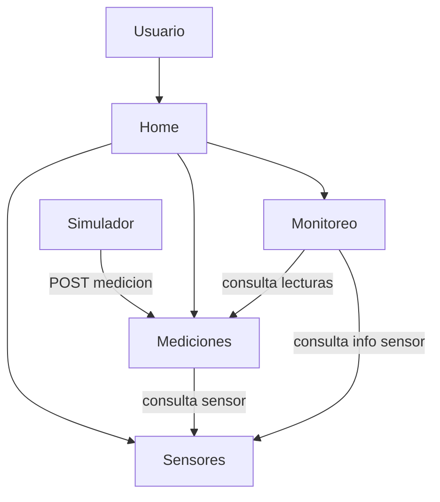

# Arquitectura — Sistema Distribuido de Monitoreo IoT (Simulado)

## 1. Descripción general

El sistema permite monitorear sensores (temperatura, humedad, etc.) cuyos datos son
generados por un simulador, ya que en este avance no se cuenta con hardware físico.
La arquitectura sigue un patrón de microservicios: cada responsabilidad (catálogo de
sensores, almacenamiento de mediciones, cálculo de alertas) vive en un servicio
independiente que se comunica por HTTP/REST.

## 2. Diagrama de arquitectura

## 2. Diagrama de arquitectura

## 3. Componentes

| Componente | Tipo | Estado en este avance |
|---|---|---|
| Home | Vista principal | Implementado y corriendo en contenedor |
| Sensores | Microservicio | Definido en Compose (stub) |
| Mediciones | Microservicio | Definido en Compose (stub) |
| Monitoreo | Microservicio | Definido en Compose (stub) |
| Simulador | Proceso generador de datos | Diseñado, se implementa en un avance posterior |

## 4. Servicios y responsabilidades

| Servicio | Responsabilidad | Información que maneja | Se comunica con |
|---|---|---|---|
| Sensores | Catálogo de sensores (alta, consulta, ubicación, tipo) | id, tipo, ubicación, estado | Mediciones, Monitoreo |
| Mediciones | Recibir y almacenar lecturas (reales o simuladas) | id_sensor, valor, unidad, timestamp | Sensores, Monitoreo |
| Monitoreo | Consultar mediciones recientes, calcular alertas | umbrales, alertas, resumen por sensor | Sensores, Mediciones |
| Simulador | Generar datos falsos periódicamente y enviarlos | — (proceso, no expone API) | Mediciones |

## 5. Comunicación entre servicios

| Quién solicita | A quién | Qué información | Método HTTP |
|---|---|---|---|
| Mediciones | Sensores | Validar existencia del sensor | `GET /sensores/:id` |
| Monitoreo | Mediciones | Últimas lecturas de un sensor | `GET /mediciones?sensor_id=X` |
| Monitoreo | Sensores | Datos del sensor (tipo, ubicación) | `GET /sensores/:id` |
| Simulador | Mediciones | Registrar una nueva lectura | `POST /mediciones` |