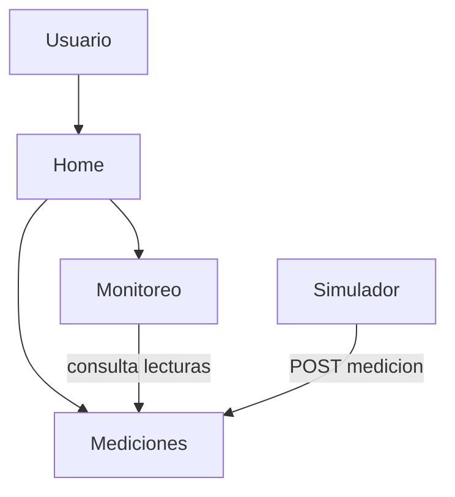

# Arquitectura — Sistema Distribuido de Monitoreo IoT (Simulado)

## 1. Descripción general

El sistema permite monitorear sensores (temperatura, humedad, etc.) cuyos datos son
generados por un simulador, ya que en este avance no se cuenta con hardware físico.
La arquitectura sigue un patrón de microservicios: cada responsabilidad
(almacenamiento de mediciones, cálculo de resúmenes y alertas) vive en un servicio
independiente que se comunica por HTTP/REST. La vista Home actúa como punto de
entrada del usuario.

## 2. Diagrama de arquitectura

## 3. Componentes

| Componente | Tipo | Estado en este avance |
|---|---|---|
| Home | Vista principal | Implementado y corriendo en contenedor |
| Mediciones | Microservicio | Implementado (API Flask) y definido en Compose |
| Monitoreo | Microservicio | Implementado (API Flask) y definido en Compose |
| Simulador | Proceso generador de datos | Implementado y definido en Compose |

## 4. Servicios y responsabilidades

| Servicio | Responsabilidad | Información que maneja | Se comunica con |
|---|---|---|---|
| Home | Presentar la vista principal del sistema al usuario | Contenido estático (HTML, CSS, JS) | — (frontend estático) |
| Mediciones | Recibir y almacenar lecturas (reales o simuladas) y permitir consultarlas | sensor_id, valor, unidad, timestamp | Monitoreo, Simulador |
| Monitoreo | Consultar las mediciones de un sensor y calcular un resumen (cantidad, promedio, última lectura) | resumen por sensor, umbrales y alertas (a futuro) | Mediciones |
| Simulador | Generar valores de temperatura y humedad para un catálogo fijo de sensores y enviarlos periódicamente | — (proceso, no expone API) | Mediciones |

## 5. Comunicación entre servicios

| Quién solicita | A quién | Qué información | Método HTTP |
|---|---|---|---|
| Monitoreo | Mediciones | Últimas lecturas de un sensor | `GET /mediciones?sensor_id=X` |
| Simulador | Mediciones | Registrar una nueva lectura | `POST /mediciones` |

## 6. Decisiones y cambios respecto al diseño inicial

- Respecto al diseño anterior se propone utilizar servicios propios para practicar el
  flujo visto en clase: `Dockerfile` → imagen → contenedor, para su posterior prueba
  y verificación.
- **Se descartó el servicio de Sensores para este avance.** El catálogo de sensores
  se maneja como una lista fija dentro del Simulador (`SENSORES` en `simulador/app.py`).
  Un servicio de Sensores independiente se evaluará más adelante si la gestión de
  dispositivos (alta/baja, ubicación, estado) lo justifica.
- La comunicación entre servicios es HTTP/REST con cuerpos JSON.
- La persistencia en base de datos se pospone para un avance posterior; por ahora las
  mediciones se guardan en memoria del proceso de Mediciones.

## 7. Qué queda pendiente

- Persistencia de datos en base de datos (las mediciones se pierden al reiniciar).
- Lógica de alertas por umbrales en el servicio de Monitoreo.
- Servicio de Notificaciones que consuma los eventos de alerta.
- Conexión de la vista Home con los servicios para mostrar datos reales.
- Autenticación, seguridad y despliegue en la nube (fuera del alcance de este avance).
