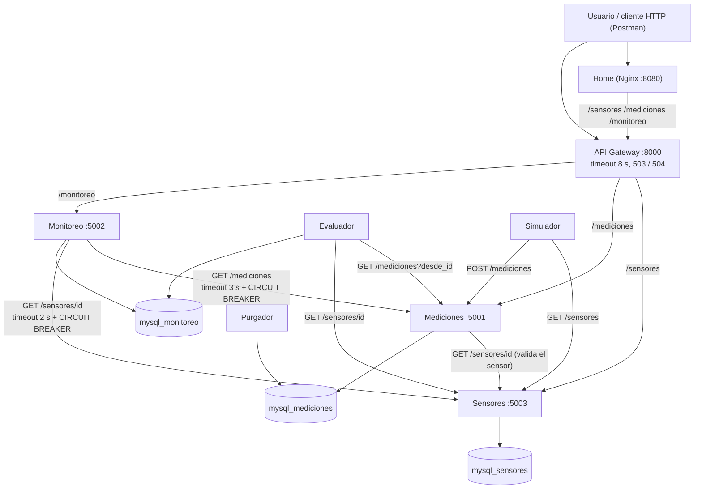

# Arquitectura — Sistema Distribuido de Monitoreo IoT (Simulado)

## 1. Descripción general

El sistema monitorea sensores (temperatura y humedad) cuyos datos genera un simulador,
ya que no se cuenta con hardware físico. Sigue una arquitectura de **microservicios**:
cada responsabilidad (catálogo de sensores, almacenamiento de mediciones, umbrales y
alertas) vive en un servicio independiente, con su propia base de datos MySQL, y se
comunica con los demás por **HTTP/REST con JSON**. La vista Home es el punto de entrada
del usuario; todas las peticiones de datos (de Home y de clientes HTTP) pasan por el
**API Gateway**, que las enruta al microservicio correspondiente. Las llamadas de Monitoreo
a otros servicios están protegidas con **timeout y Circuit Breaker**.

## 2. Diagrama de arquitectura

```mermaid
flowchart TD
    U["Usuario / cliente HTTP (Postman)"] --> H["Home (Nginx :8080)"]
    U --> G
    H -- "/sensores /mediciones /monitoreo" --> G["API Gateway :8000<br/>timeout 8 s, 503 / 504"]
    G -- "/sensores" --> S["Sensores :5003"]
    G -- "/mediciones" --> M["Mediciones :5001"]
    G -- "/monitoreo" --> MO["Monitoreo :5002"]
    MO -- "GET /mediciones<br/>timeout 3 s + CIRCUIT BREAKER" --> M
    MO -- "GET /sensores/id<br/>timeout 2 s + CIRCUIT BREAKER" --> S
    M -- "GET /sensores/id (valida el sensor)" --> S
    EV[Evaluador] -- "GET /mediciones?desde_id" --> M
    EV -- "GET /sensores/id" --> S
    EV --> DBMO
    PU[Purgador] --> DBM
    SIM[Simulador] -- "GET /sensores" --> S
    SIM -- "POST /mediciones" --> M
    M --> DBM[("mysql_mediciones")]
    S --> DBS[("mysql_sensores")]
    MO --> DBMO[("mysql_monitoreo")]
```

## 3. Componentes

| Componente | Tipo | Puerto | Base de datos |
|---|---|---|---|
| API Gateway | Servicio Flask + gunicorn: enruta a Sensores, Mediciones y Monitoreo | 8000 | — |
| Home | Frontend estático (Nginx sin privilegios); reenvía las rutas de datos al Gateway | 8080 → 8080 | — |
| Mediciones | Microservicio Flask | 5001 | `mediciones` (en `mysql_mediciones`) |
| Sensores | Microservicio Flask | 5003 | `sensores` (en `mysql_sensores`) |
| Monitoreo | Microservicio Flask | 5002 | `monitoreo` (en `mysql_monitoreo`) |
| Evaluador | Worker (imagen de Monitoreo) que evalúa lecturas nuevas, registra alertas y purga las antiguas | — | `monitoreo` (en `mysql_monitoreo`) |
| Purgador | Worker (imagen de Mediciones) que borra las lecturas más antiguas que `RETENCION_DIAS` | — | `mediciones` (en `mysql_mediciones`) |
| Simulador | Proceso generador de datos | — | — |

Todos los contenedores comparten la red `red_iot` de Docker Compose y se resuelven por
nombre de servicio. Solo Home (8080) y el Gateway (8000) se publican en el host; las APIs y las
bases quedan en la red interna (`compose.dev.yaml` publica los puertos de las APIs para desarrollo).

### Inventario de servicios

| Microservicio | Responsabilidad | Base de datos | Comunicación con otros servicios | Estado |
|---|---|---|---|---|
| Sensores | Catálogo de sensores (CRUD) | `sensores` | Ninguna (lo consultan los demás) | Implementado |
| Mediciones | Lecturas de sensores (CRUD, estadísticas) | `mediciones` | Sensores (valida el sensor) | Implementado |
| Monitoreo | Umbrales (CRUD), alertas, resúmenes y evaluación | `monitoreo` | Mediciones y Sensores (con timeout y Circuit Breaker) | Implementado |
| API Gateway | Punto de entrada único hacia las APIs | — | Sensores, Mediciones, Monitoreo | Implementado |
| Home | Interfaz web | — | Gateway | Implementado |
| Evaluador | Evalúa lecturas nuevas y registra alertas (worker) | `monitoreo` | Mediciones, Sensores | Implementado |
| Purgador | Retención de lecturas (worker) | `mediciones` | — | Implementado |
| Simulador | Genera lecturas simuladas | — | Sensores, Mediciones | Implementado |
| Notificaciones | Enviar avisos con las alertas | — | — | **Fuera de alcance** (no forma parte de esta entrega) |

## 4. Responsabilidades

| Servicio | Responsabilidad | Información que maneja |
|---|---|---|
| API Gateway | Punto de entrada único: identifica el servicio por la ruta, reenvía método, cuerpo y código de estado, y traduce fallos de comunicación (503/504); exige credenciales para escribir | Ninguno (sin lógica de negocio ni BD) |
| Home | Presentar el dashboard; sus peticiones de datos van al Gateway | HTML, CSS, JS |
| Mediciones | Registrar, consultar, modificar y borrar lecturas | `sensor_id`, `valor`, `unidad`, `timestamp` |
| Sensores | Catálogo de sensores (alta, baja, estado activo) | `nombre`, `tipo`, `ubicacion`, `activo` |
| Monitoreo | Resúmenes, umbrales por tipo y alertas | `umbrales`, `alertas` |
| Evaluador | Evaluar automáticamente las lecturas nuevas contra los umbrales, registrar alertas y borrar las antiguas | `alertas` |
| Purgador | Aplicar la retención de lecturas (borrado por lotes cada hora) | — |
| Simulador | Generar lecturas de los sensores activos y enviarlas | — |

## 5. Comunicación entre servicios

| Solicita | Responde | Endpoint | Enviado | Recibido |
|---|---|---|---|---|
| Simulador | Mediciones | `GET /health` | — | `{"status":"ok"}` |
| Simulador | Sensores | `GET /sensores?activo=true` | filtro `activo` | Lista de sensores activos |
| Simulador | Mediciones | `POST /mediciones` | `sensor_id`, `valor`, `unidad` | `201` con la medición creada |
| Monitoreo | Mediciones | `GET /mediciones?sensor_id=X&limit=N` | `sensor_id`, `limit` opcionales | Lista de mediciones en orden cronológico |
| Monitoreo | Sensores | `GET /sensores/<id>` | `id` del sensor | Sensor con su `tipo` (si falla, el tipo se deduce de la unidad) |
| Mediciones | Sensores | `GET /sensores/<id>` | `id` del sensor | `200`/`404` (si Sensores no responde, la lectura se acepta) |
| Home (vía Nginx) | Mediciones | `/mediciones/...` | Petición del navegador | Respuesta JSON de la API |
| Home (vía Nginx) | Monitoreo | `/monitoreo/...` | Petición del navegador | Respuesta JSON de la API |

### Ubicación de Timeout y Circuit Breaker

| Dependencia | Timeout | Circuit Breaker | Si falla |
|---|---|---|---|
| Gateway → cualquier servicio | `GATEWAY_TIMEOUT` = 8 s | No | `504` (timeout) o `503` (caído) |
| Monitoreo → Mediciones | `MEDICIONES_TIMEOUT` = 3 s | Sí (3 fallas, recuperación 10 s) | `504`, `503` o `502` |
| Monitoreo → Sensores | `SENSORES_TIMEOUT` = 2 s | Sí (3 fallas, recuperación 10 s) | La evaluación continúa deduciendo el tipo de la unidad |

El timeout del Gateway es mayor que los de Monitoreo para que sea Monitoreo quien responda su
propio `504` y el Gateway lo reenvíe sin cambiarlo. Detalle y pruebas en el
[README](../../README.md#timeout-y-circuit-breaker) y en [docs/pruebas](../pruebas/README.md).

## 6. Decisiones de diseño

- **Una base MySQL por servicio**: cada servicio es dueño de sus datos; ninguno accede
  a la base de otro, solo a su API.
- **Autoinicialización**: cada servicio crea sus tablas al arrancar (gunicorn lo hace una
  sola vez, en `on_starting`) y reintenta mientras MySQL queda disponible. Si no lo logra,
  el proceso termina con error y Docker lo reinicia. Compose espera el healthcheck de
  cada MySQL y de cada API (`depends_on: condition: service_healthy`).
- **Mínimo privilegio en BD**: cada MySQL crea un usuario con permisos solo sobre la base de
  su servicio; los servicios no usan `root`.
- **Consultas acotadas**: Mediciones devuelve por defecto las 100 lecturas más recientes y
  calcula totales y promedios en SQL (`/mediciones/estadisticas`); nadie descarga la tabla completa.
- **Integridad entre servicios (mejor esfuerzo)**: Mediciones comprueba que el `sensor_id` exista en
  Sensores. No hay claves foráneas entre bases; si el catálogo no responde, se prefiere no perder la
  lectura. Las alertas son un registro histórico: guardan su propia copia de `valor` y `timestamp`, por
  lo que borrar una medición no invalida la alerta que ya generó.
- **Tiempo en UTC y `DATETIME(3)`**: los `timestamp` se guardan como `DATETIME(3)` en UTC y la API los
  entrega en ISO 8601. El sensor puede enviar su propia hora (`timestamp` opcional).
- **Imágenes fijadas y sin root**: MySQL 8.4, nginx 1.28 y Python 3.12; los contenedores Python corren
  con un usuario sin privilegios y Home usa `nginx-unprivileged`.
- **Código repetido entre servicios (decisión)**: `cursor_bd`, `database.py` y las funciones de validación
  numérica se repiten en Mediciones, Monitoreo y Sensores. Se acepta a propósito: cada servicio se construye
  solo con su carpeta como contexto de Docker y se despliega de forma independiente; una biblioteca común
  obligaría a ampliar ese contexto o a publicar un paquete. Dentro de un mismo servicio no se repite nada
  (por ejemplo, POST y PUT de Mediciones comparten `validar_medicion`). Conviene revisarlo si aparece un
  cuarto servicio con base de datos.
- **Interfaz sin dependencias externas**: Chart.js se sirve desde `home/vendor/` (sin CDN) y Nginx aplica
  una política de seguridad de contenido estricta (sin scripts ni estilos en línea).
- **Escritura protegida en el borde**: Nginx deja consultar libremente, pero crear, modificar y borrar
  (`POST`, `PUT`, `PATCH`, `DELETE`) exige las credenciales de `HOME_ADMIN_USER` / `HOME_ADMIN_PASSWORD`
  (autenticación Basic; `401` si faltan o no coinciden). La excepción es `POST /monitoreo/evaluar/*`, que es
  idempotente. Las credenciales se validan en Nginx y no se reenvían a las APIs, que siguen sin autenticación
  propia: por eso solo Home se publica. Se aceptó una única cuenta y HTTP sin cifrar (válido en local o en una
  demostración); con HTTPS y usuarios con roles el esquema crecería hacia un servicio de identidad.
- **Retención de datos**: las lecturas se conservan `RETENCION_DIAS` (30 por defecto). Un proceso aparte (el
  Purgador) las borra por lotes cada hora, y el Evaluador hace lo mismo con las alertas. Separarlo de la API
  evita que una purga larga compita con las peticiones y sigue el mismo patrón que el Evaluador.
- **Lecturas editables, pero con credenciales**: se mantienen `PUT`, `PATCH` y `DELETE` sobre las lecturas para
  poder corregir errores; en telemetría pura serían inmutables, y esa restricción es una decisión pendiente
  de revisar si el sistema pasa a producción.
- **Evaluación automática**: el Evaluador procesa las lecturas nuevas con `desde_id`, en lugar
  de depender de que alguien pulse "Evaluar".
- **Servicio Sensores independiente**: el catálogo ya no es una lista fija del
  Simulador. El Simulador y Monitoreo lo consultan; el Simulador conserva un catálogo
  de respaldo si Sensores no responde.
- **Home como proxy**: Nginx sirve la interfaz y reenvía `/mediciones` y `/monitoreo`,
  evitando problemas de CORS y puertos desde el navegador.

- **API Gateway como único punto de entrada**: Home y los clientes HTTP entran por él. Solo enruta:
  no repite SQL ni lógica de negocio. Reutiliza las credenciales de administración para proteger la escritura.
- **Circuit Breaker con `pybreaker` y un solo proceso en Monitoreo**: el estado vive en memoria; con
  varios procesos cada uno tendría su propio contador. Los hilos de gunicorn atienden la concurrencia.
- **Solo las fallas técnicas abren el circuito** (timeout, conexión, 5xx); un 404 de la dependencia es una
  respuesta válida y no cuenta.
- **Demora simulada en Mediciones** (`PUT /mediciones/simulacion/demora`) para poder demostrar el Timeout sin
  modificar código; se guarda en un archivo compartido por los workers y se restablece con `0`.

## 7. Cambios de contrato respecto a versiones anteriores

- `GET /mediciones/sensor/<sensor_id>` reemplaza a `GET /mediciones/<sensor_id>`;
  ahora `GET /mediciones/<int:id>` devuelve una medición por su identificador.
- `GET /monitoreo/<sensor_id>` devuelve `404` cuando el sensor no tiene lecturas.
- `POST /monitoreo/evaluar/<sensor_id>` registra la alerta; `GET` sigue disponible pero es de solo lectura.
- `GET /monitoreo/resumen-general` devuelve `promedios_por_unidad` en lugar de `promedio_global_sistema`
  (promediar °C con % no tiene sentido).
- `GET /mediciones` y `GET /mediciones/sensor/<sensor_id>` devuelven como máximo las 100
  más recientes si no se indica `limit` (tope 1000).
- Escribir a través de Home (`POST`, `PUT`, `PATCH`, `DELETE`) exige credenciales de administración y responde
  `401` si faltan. Consultar y `POST /monitoreo/evaluar/*` siguen siendo libres.
- Las lecturas y alertas con más de `RETENCION_DIAS` (30 por defecto) se borran automáticamente.

## 8. Pendiente

- Notificaciones: fuera del alcance de esta entrega; las alertas se consultan en Monitoreo.
- HTTPS y usuarios con roles (hoy hay una sola cuenta de administración).
- Despliegue en la nube.
